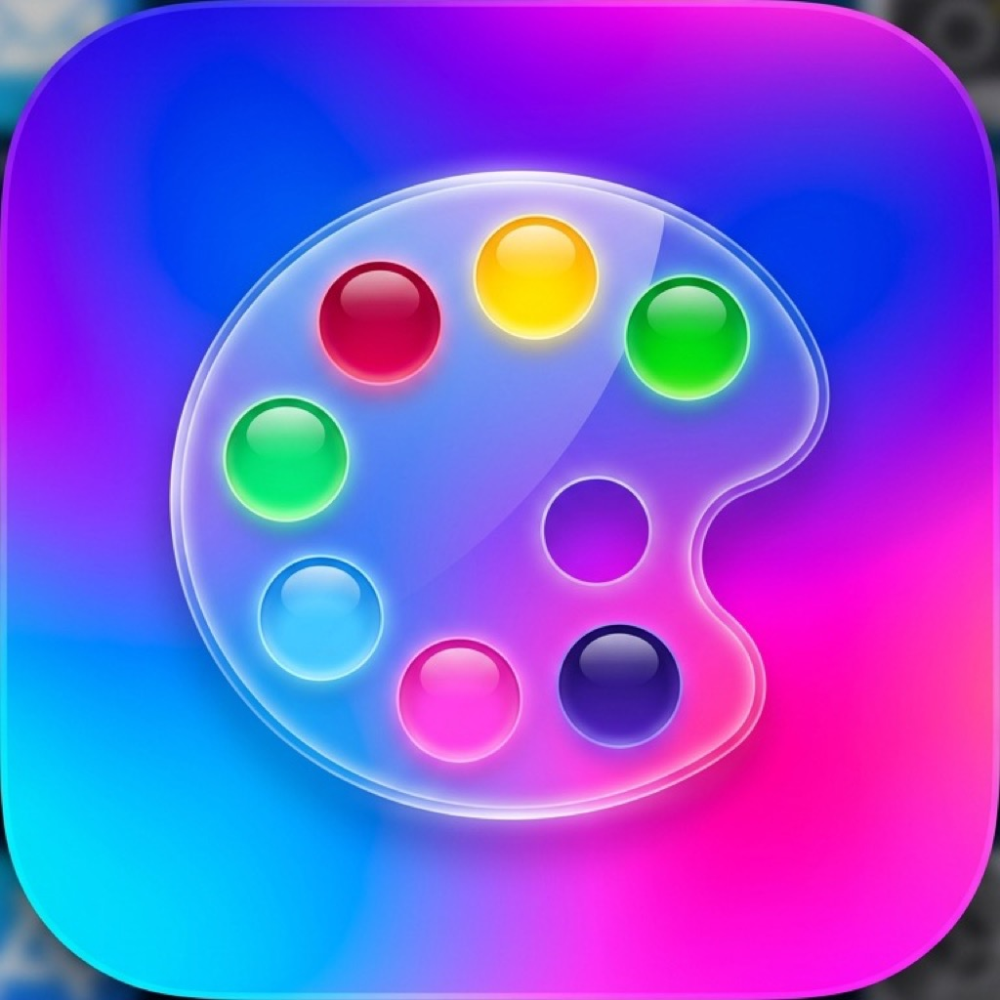

  

  

  <h1>Chroma Echo</h1>

  

    <strong>A modern color memory game for iPhone.</strong> 
    See the color. Remember the tone. Match it as closely as you can.
  

  

    <a href="#features">Features</a> •
    <a href="#game-modes">Game Modes</a> •
    <a href="#premium">Premium</a> •
    <a href="#privacy">Privacy</a> •
    <a href="#support">Support</a>
  

---

## About The Game

**Chroma Echo**, localized in Turkish as **Renk Hafızası**, is a color memory game built around focus, visual perception, and precise shade matching.

The game shows you a color tone for a short time. Then the color disappears, and you use the in-game palette to recreate the closest possible shade. Your result is measured as a match percentage.

It starts simple, then grows into a deeper memory challenge with Color Quest stages, multi-color sequences, shape-color memory tasks, Game Center rankings, and optional rewarded hints.

---

## Features

- **Color Quest map progression** with hundreds of stages.
- **Precise color palette matching** instead of simple color buttons.
- **Single-color memory challenges** for fast, focused rounds.
- **Multi-color sequence challenges** where colors must be remembered in order.
- **Shape + color memory challenges** where every shape has its own remembered color.
- **Solo, Duo, and Party modes** for personal practice or same-device play.
- **Game Center leaderboard** for highest reached progress.
- **Masked player names** in the custom leaderboard interface.
- **Optional rewarded hints** for difficult Color Quest stages.
- **Premium access** for unlimited energy, standard ad-free play, and full leaderboard access.

---

## How It Works

1. **Memorize**  
   Watch the color, color sequence, or colored shape challenge.

2. **Match**  
   Use the palette to recreate the remembered tone.

3. **Compare**  
   See your match percentage and compare the shown color with your selection.

4. **Progress**  
   Complete stages, unlock the map, and compete on Game Center.

---

## Game Modes

### Color Quest

The main progression experience. Move through the map, complete stages, unlock new challenges, and push your color memory further.

### Solo

Practice alone and try to improve your match percentage.

### Duo

Two players compete on the same device.

### Party

Local same-device play for up to four players.

---

## Premium

Premium unlocks:

- Unlimited energy.
- Standard ad-free play.
- Full Top 50 leaderboard access.

Premium is available as a monthly subscription or lifetime purchase.

**Remove Ads** removes standard ads only. It does not unlock unlimited energy or full leaderboard access.

Rewarded hint ads are optional and user-initiated. They remain separate from standard ads.

---

## Game Center

Game Center is optional. You can play Chroma Echo without signing in.

Game Center is used for:

- Leaderboard participation.
- Highest reached progress ranking.
- Optional progress import prompts when available.

The app does not use Game Center as an automatic cloud save system.

---

## Privacy

Chroma Echo is designed so the core game can be played without creating an account.

The app may use:

- Apple Game Center for optional leaderboard features.
- Apple StoreKit for in-app purchases.
- Google AdMob for advertising.
- Local device storage for game progress.

[Privacy Policy](https://docs.google.com/document/d/e/2PACX-1vS4rUJ4VJPej3V8FFsrAo3KDfCARIUmBEGBtahW8DN0xn2rzIs32xH94bKRx3Mh15gYzoY0Jykc9T5g/pub)

[Terms of Use - Apple Standard EULA](https://www.apple.com/legal/internet-services/itunes/dev/stdeula/)

---

## Support

If you need help, please include:

- Your device model.
- Your iOS version.
- The app version.
- A short description of the issue.
- A screenshot or screen recording if possible.

You can contact the developer through the support/contact information available on the App Store product page.

---

## Türkçe

**Renk Hafızası**, ekranda kısa süre gösterilen renk tonunu hatırlayıp oyun içindeki renk paletiyle en yakın tonu yakalamaya çalıştığın modern bir hafıza oyunudur.

Color Quest haritasında ilerleyebilir, tek renkli görevleri tamamlayabilir, sıralı renkleri hatırlayabilir, şekil ve renk eşleşmelerini çözebilir, Solo/Duo/Party modlarında oynayabilir ve Game Center liderlik tablosunda ilerlemeni takip edebilirsin.

Oynamak için Game Center zorunlu değildir. Satın almalar isteğe bağlıdır. Gizlilik Politikası ve Kullanım Şartları bağlantıları yukarıdadır.
